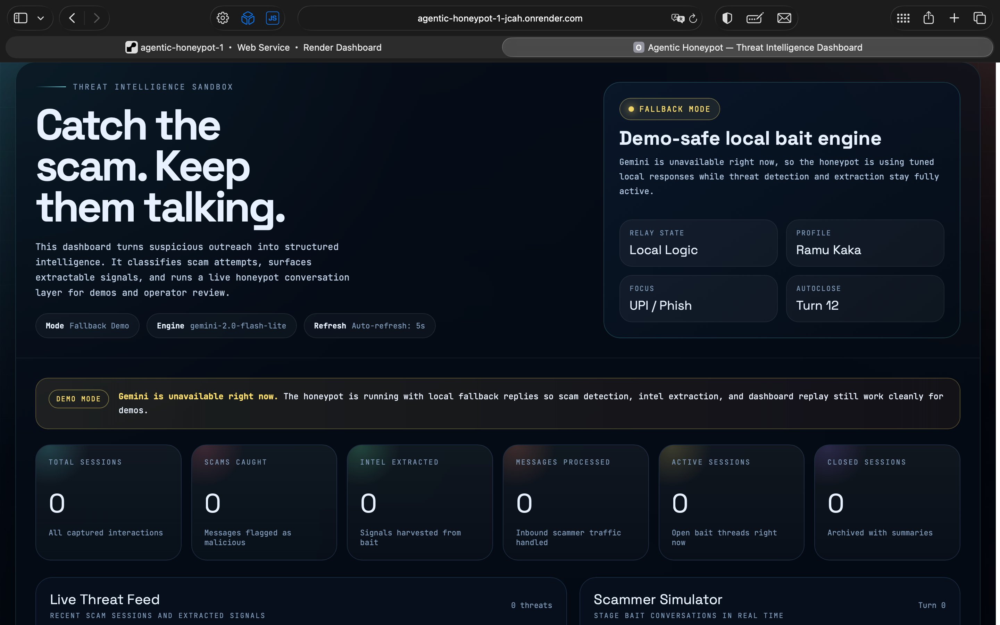

# 🍯 Agentic Honeypot — AI-Powered Scam Intelligence System

> An autonomous AI agent that lures scammers, engages them in multi-turn conversations, and extracts actionable threat intelligence — all without human intervention.


---

## 🔗 Live Demo
👉 **[https://agentic-honeypot-1-jcah.onrender.com](https://agentic-honeypot-1-jcah.onrender.com)**



---

## 🎯 What It Does

Most scam detection systems **block** threats. This system **engages** them.

The honeypot impersonates a gullible victim ("Ramu Kaka") and autonomously:
- **Detects** scam messages across 6 categories (UPI fraud, phishing, lottery, job fraud, KYC, investment)
- **Engages** the scammer in believable multi-turn conversation using Gemini AI
- **Extracts** intelligence: UPI IDs, phone numbers, phishing links, bank accounts, IFSC codes
- **Reports** findings with confidence scores and structured summaries
- **Visualizes** everything on a live threat intelligence dashboard

---

## 🏗️ Architecture

```
Scammer Message
      │
      ▼
┌─────────────────┐
│  Scam Detector  │ ← Rule-based pattern matching (6 scam types)
└────────┬────────┘
         │
         ▼
┌─────────────────┐
│  Intel Extractor│ ← Regex-based: UPI IDs, phones, links, accounts
└────────┬────────┘
         │
         ▼
┌─────────────────┐
│  Gemini AI Agent│ ← Plays "Ramu Kaka", keeps scammer engaged
└────────┬────────┘
         │
         ▼
┌─────────────────┐
│  Session Manager│ ← Tracks state, decides when to close
└────────┬────────┘
         │
         ▼
  Intelligence Report + Live Dashboard
```

---

## 🚀 Features

| Feature | Description |
|---|---|
| **Multi-turn Agentic Conversations** | AI maintains context across entire scammer interaction |
| **6 Scam Categories** | UPI fraud, lottery, job fraud, bank KYC, investment scam, phishing |
| **Real-time Intel Extraction** | UPI IDs, phone numbers, phishing URLs, bank accounts, IFSC, Aadhaar patterns |
| **Confidence Scoring** | Each detected scam is scored 0–1 based on pattern density |
| **Live Dashboard** | Real-time threat feed with session replay and scammer simulator |
| **REST API** | Hackathon-compliant + extended endpoints |
| **Fallback Mode** | Works without API key using smart rule-based responses |
| **Session Management** | Auto-closes sessions after intel extraction or max turns |

---

## 🧪 Try It Live

Open the dashboard and use the **Scammer Simulator** panel. Paste any of these:

```
Congratulations! You have won Rs 50,000 lottery. Send your UPI ID to claim.
```
```
Sir your bank KYC is expired. Verify now at http://secure-verify-bank.net/login
```
```
Work from home job available. Earn Rs 5000 daily. Registration fee only Rs 499. Pay on jobshelp@paytm
```
```
Invest Rs 1000 today and get Rs 10000 in 7 days guaranteed. Call 9876543210 now.
```

---

## 📡 API Endpoints

### Primary (Hackathon-Compliant)
```bash
POST /hcs_A0001
Headers: x-api-key: <your-key>
Body: { "sessionId": "abc123", "message": "Congratulations! You won Rs 50,000..." }
Response: { "status": "success", "reply": "Arre wah! Kitne paise milenge exactly?" }
```

### Extended
```
POST /api/honeypot       → Full response with intel + scam detection
GET  /api/session/<id>   → Full session data
GET  /api/threats        → All closed threat sessions
GET  /api/stats          → System-wide statistics
GET  /api/threat_feed    → Public threat feed for dashboard
GET  /health             → Health check
GET  /                   → Live dashboard
```

---

## 🛠️ Local Setup

```bash
git clone https://github.com/akshat-create/agentic-honeypot
cd agentic-honeypot

python3.12 -m venv .venv
source .venv/bin/activate

pip install -r requirements.txt

cp .env.example .env
# Add your GEMINI_API_KEY (optional — fallback mode works without it)

python app.py
# → http://localhost:5000
```

---

## ☁️ Deploy to Render (Free)

1. Push to GitHub
2. Go to [render.com](https://render.com) → New Web Service → connect repo
3. Set environment variables: `GEMINI_API_KEY`, `SECRET_API_KEY`, `PORT=10000`
4. Build command: `pip install -r requirements.txt`
5. Start command: `gunicorn app:app --bind 0.0.0.0:$PORT --workers 2`

---

## 📊 Intelligence Extracted

The system automatically extracts:
- **UPI IDs** — `scammer@paytm`, `fraud@okaxis`
- **Phone Numbers** — Indian mobile numbers (6–9 series)
- **Phishing Links** — Full URLs from messages
- **Bank Account Numbers** — 9–18 digit sequences
- **IFSC Codes** — Standard format detection
- **Aadhaar Patterns** — 12-digit number patterns

---

## 🔮 Roadmap

- [ ] Telegram bot integration for real-time alerts
- [ ] PostgreSQL persistence for session storage
- [ ] WhatsApp Business API honeypot channel
- [ ] ML-based scam classifier (replace rule-based)
- [ ] Multi-language support (Hindi, Tamil, Telugu)
- [ ] Threat intelligence STIX export

---

## 👨‍💻 Author

**Akshat Pandey** — B.Tech CSE (Data Science), 2nd Year
[GitHub](https://github.com/akshat-create) · [LinkedIn](https://www.linkedin.com/in/akshatpandey8299/)

Originally built for the **India AI-Impact Buildathon 2026**. Upgraded to production-grade for real-world deployment.

---

## ⚠️ Disclaimer

This tool is for **cybersecurity research and education only**. It helps document and understand scam patterns to protect potential victims. Do not use against real people outside of controlled research environments.
